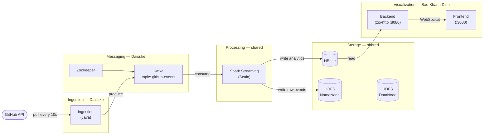

```
  ██████╗ ██╗ ██████╗     ██████╗  █████╗ ████████╗ █████╗
  ██╔══██╗██║██╔════╝     ██╔══██╗██╔══██╗╚══██╔══╝██╔══██╗
  ██████╔╝██║██║  ███╗    ██║  ██║███████║   ██║   ███████║
  ██╔══██╗██║██║   ██║    ██║  ██║██╔══██║   ██║   ██╔══██║
  ██████╔╝██║╚██████╔╝    ██████╔╝██║  ██║   ██║   ██║  ██║
  ╚═════╝ ╚═╝ ╚═════╝     ╚═════╝ ╚═╝  ╚═╝   ╚═╝   ╚═╝  ╚═╝

  GitHub Pulse — Real-time Repository Analytics
  Kafka · Spark Streaming · HBase
```


## Data Flow



## Requirements

- JDK 11+
- Docker
- GitHub personal access token

## Run locally

```bash
GITHUB_TOKEN=<your_token> bash infra/dev.sh
```
## Live
https://visualization-frontend.lifespacedigital.com/
